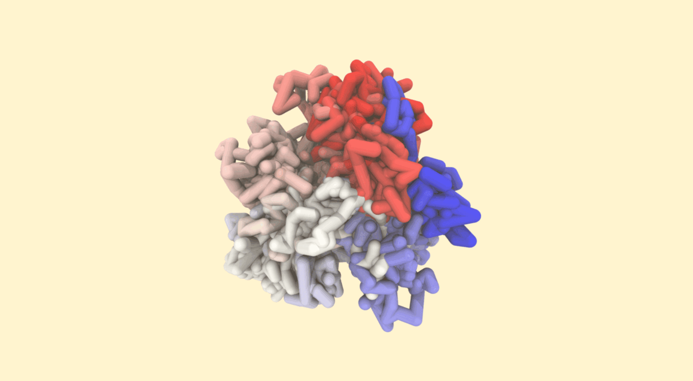
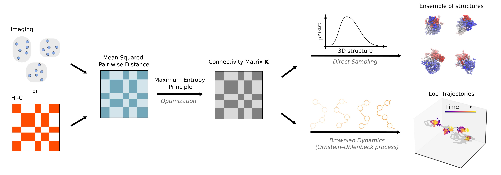

[**Installation**](#install) | [**Quick Start**](#quick-start) | [**API**](#api) | [**Chromatin Dynamics**](#dynamics-prediction-functionality) | [**Chromatin Mechanics**](#modulus-calculation)

This python program is the implementation of the HIPPS-DIMES method[^1][^2][^3]. HIPPS-DIMES is a computational method based on the maximum entropy principle, with experimental measured contact map or pair-wise distances as constraints, to generate a unique ensemble of <ins>3D chromatin structures</ins>. In a nutshell, this program accepts the input file of a mean spatial distance map (which can be measured in Multiplexed FISH experiment) or a Hi-C contact map (which is converted to distance map internally), and generates an ensemble of individual chromatin conformations that are consistent with the input.

In addition to reconstructing static 3D chromatin structures, the model is also able to predict **chromatin loci dynamics** as well as **chromatin loci mechanics** based on polymer physics and the Ornstein–Uhlenbeck process. This allows you to simulate time-dependent properties such as autocorrelation functions (ACF), mean-square displacement (MSD) of individual loci and modulus of individual loci, providing insights into the dynamic behavior of chromatin.



The theory and applications of this method can be found in our work published:

- Shi, Guang, and D. Thirumalai. "Epigenetic state encodes locus-specific chromatin mechanics." bioRxiv (2025): 2025-12. [link](https://www.biorxiv.org/content/10.64898/2025.12.27.696709v1.abstract)
- Shi, Guang, and D. Thirumalai. "From Hi-C contact map to three-dimensional organization of interphase human chromosomes." Physical Review X 11.1 (2021): 011051. [link](https://journals.aps.org/prx/abstract/10.1103/PhysRevX.11.011051)
- Shi, Guang, and D. Thirumalai. "A maximum-entropy model to predict 3D structural ensembles of chromatin from pairwise distances with applications to interphase chromosomes and structural variants." Nature Communications 14.1 (2023): 1150. [link](https://www.nature.com/articles/s41467-023-36412-4)
- Shi, Guang, Sucheol Shin, and D. Thirumalai. "Static three-dimensional structures determine fast dynamics between distal loci pairs in interphase chromosomes." Science Advances 11.31 (2025): eadx1763. [link](https://www.science.org/doi/full/10.1126/sciadv.adx1763)

Other applications of this method can be found in:
- Dey, Atreya, et al. "Structural changes in chromosomes driven by multiple condensin motors during mitosis." Cell Reports 42.4 (2023).
- Jeong, Davin, et al. "Structural basis for the preservation of a subset of topologically associating domains in interphase chromosomes upon cohesin depletion." Elife 12 (2024): RP88564.

# Documentation

## Requirements

- Python 3.9+

## Install

First, download this repository using,

```bash
git clone https://github.com/anyuzx/HIPPS-DIMES
cd HIPPS-DIMES
```

#### Using pip
```bash
pip install -e .
```

#### Using UV
```bash
uv pip install -e .
```

This command will install the required packages from `pyproject.toml`, and install the script as a
python module. Once installed, you can call `HippsDimes` directly in the terminal to run the script.

### Dependencies

The package requires:
- Python 3.9+
- `Click` - Command line interface (fallback when rich-click is not installed)
- `Rich-Click` - Rich-styled CLI (used when installed; falls back to Click otherwise)
- `Numpy` - Numerical computing
- `Scipy` - Scientific computing
- `Pandas` - Data manipulation
- `Tqdm` - Progress bars
- `Cooler` - .mcool or .cool data format support
- `Rich` - Rich terminal output
- `hic-straw` - .hic format support

**Optional (for GPU acceleration):**
- `CuPy` - GPU-accelerated computing via CUDA

To install CuPy for GPU support:
```bash
conda install -c conda-forge cupy
# or
pip install cupy-cuda11x  # Replace with your CUDA version
```

## Quick start

The quickest way to get started is to run our example notebook in Google Colab. Here are some starter notebooks:

- [Quick start](https://colab.research.google.com/drive/1w7cK6S3z2_D5Mzgq2-SZgl4FoDjT9EC5?usp=sharing)
- [Chromatin Dynamics and Mechanics](https://colab.research.google.com/drive/1DsTIJTkiKc1vRq6lBncEg4nvPh4hQ4hp?usp=sharing)

In addition, it is helpful to view the help information for each arguments andoptions. To display help information, use

```bash
HippsDimes --help
```

## API

### Input files

This script accepts input files in two formats. If the input file is a Hi-C
contact map, it can be in either `.cool` format (see https://github.com/open2c/cooler for details of the `cooler` library), '.hic' format (via hicstraw) or pure text format. If the
input file is a mean spatial distance map, the script only accepts a pure text
formatted file. The text format for a matrix is the following: each row of the
file corresponds to the row of the matrix. Values are space-separated. The
content of the file should look like this,

```text
1  2  3
2  1  2
3  2  1
```

### Output files

This script will generate several files:

- A text file for the final simulated mean distance map
- A text file for the final simulated contact map (this is the best agreement contact map to the _normalized_ input contact map)
- A text file for the connectivity matrix
- A `.xyz` formatted file for the ensemble of genome structures generated (can
  be turned off)
- A csv formatted file for cost versus iteration data (can be turned off)

### Explanation of the arguments and options

#### Arguments

- `INPUT`: File path for the input file. The input file can be a Hi-C contact
  map or a mean spatial distance map as measured in Multiplexed FISH experiment.
- `OUTPUT_PREFIX`: Prefix for output files. For instance, if one specifies it to be
  `TEST`, then all the output files will start with `TEST_`.

#### Options

- `-k, --connectivity-matrix`: Provide the path to the existing connectivity
  matrix one would like to use as initialization. Useful if restarting using the
  result from the previous run.
- `-e, --ensemble`: Number of individual conformations to be generated. This
  script will generate an ensemble of structures consistent with the input Hi-C
  contact map or the mean spatial distance map. Each individual conformations
  are different from each other. You can specify how many such individual
  conformations you want to generate. Default: 1000.
- `-a, --alpha`: Value of the contact map to distance map conversion
  exponent. If the input file is Hi-C contact map, the method first converts the
  contact map to a mean spatial distance map. The equation of the conversion is
  d_{ij} ~ c_{ij}^{1/\alpha}. The default value of α is 4.0, estimated in
  this work 10.1126/science.aaf8084. Default: 4.0.
- `-s, --selection`: Specify chromosome or region. This option is required
  when the input file has `cooler` or `.hic` format. For cooler files, the value is passed to the `cooler.Cooler.matrix().fetch()` method. For .hic files, use format "chr1:start1-end1,chr2:start2-end2". For details on cooler selectors, please refer to their [documentation](https://cooler.readthedocs.io/en/latest/concepts.html#matrix-selector).
- `-m, --method`: Specify the method used for optimization. Options: IS (Iterative Scaling, default), GD (Gradient Descent), DI (Direct Inversion). When using Direct Inversion, no iterations are performed. The connectivity matrix is obtained by direct Moore–Penrose inverse of the covariance matrix. Note that the resulting connectivity matrix using Direct Inversion can be very different from the results obtained by GD or IS method.
- `-l, --lamd`: Specify the weight for L1 or L2 regularization. Default value is 0.0, meaning no regularization. Regularization is typically used to avoid over-fitting.
- `-r, --reg`: Specify the type of regularization. Options: L1, L2 (default). This option should be used together with option `-l`.
- `--gaussian-noise-variance`: Noise variance for independent Gaussian noise on constraints (IS/GD only). This enables denoising when Gaussian noise with known variance is assumed. Cannot be combined with `--lamd`.
- `-i, --iteration`: The method relies on iterative scaling to find the optimal parameters. This option specifies the number of iterations. Generally, the more iterations the model runs, the better results are. However, the convergence of the model slows down when iteration increases. For larger size of contact map and the mean distance map, the number of iterations needed for good convergence is larger. Default: 10000.
- `--learning-rate`: Learning rate. This hyperparameter controls the speed of convergence. If its value is too small, then convergence is very slow. If its value is too large, the program may never converge. Typically, learning rate can be set to be 1-30 if using Iterative scaling method. It should be a very small value (such as 1e-8) when using gradient descent optimization. Default: 10.0.
- `--momentum`: Momentum coefficient for IS method (0.0 to 1.0). Accelerates convergence by accumulating gradient history. **Recommended: Use 0.95 with `--nesterov` for fastest convergence (~50% faster).** Use 0.9 for more conservative settings. Only applies when method=IS. Default: 0.0.
- `--nesterov`: Use Nesterov Accelerated Gradient (NAG). Enables higher momentum values (0.95) without divergence. **Recommended: Use with `--momentum 0.95` for best performance.**
- `--use-gpu`: Enable GPU acceleration via CuPy. Provides 2-4x speedup for large matrices (n ≥ 200). Requires CuPy to be installed.
- `--gpu-float32`: When using `--use-gpu`, run GPU math and eigendecomposition in float32 (often faster; slightly different numerics). Default: false.
- `--save-steps`: Comma-separated list of iteration steps at which to save the connectivity matrix. Example: `--save-steps 1000,5000,10000`. Files are saved as `{output_prefix}_connectivity_matrix_iter{step}.txt`. When used as a library (without `output_prefix`), connectivity matrices at these steps are still returned in `results['connectivity_matrix_at_steps']`.
- `--eigh-threads`: Number of threads for eigenvalue (eigh) and BLAS/LAPACK. If not set, the backend default is used. Set to 1 for single-threaded runs.
- `--input-type`: The type of the input file. To use the script, the type must be specified. Options: `cmap` (contact map) or `dmap` (distance map). This option is required.
- `--input-format`: The format of the input file. Options: `text`, `cooler`, or `hic`. If the type of input file is Hi-C contact map, then the script supports `cooler` format Hi-C contact map file, `.hic` format, or a pure text-based file. In the text-based file, each line corresponds to the row of the contact map. If the type of input file is mean distance map, then the script only supports the text-based file in which each line represents the row of the mean distance map. This option is required.
- `--binsize`: Bin size (resolution) for .hic format in bp. Default: 25000.
- `--norm`: Normalization for .hic format. Options: KR, VC, NONE. Default: KR.
- `--unit`: Unit for .hic format. Options: BP, FRAG. Default: BP.
- `--log`: A log file will be written if this option is specified. The log file contains the data of cost versus iteration.
- `--no-xyzs`: Turn off writing x,y,z coordinates of genome structures to files.
- `--ignore-missing-data`: Turn on this argument will let the program ignore the missing elements or infinite numbers in the contact map or distance map.
- `--balance`: Turn on the matrix balance for contact map. Only effective when `input_type == cmap` and `input_format == cooler`.
- `--neighbor-balance`: Turn on neighbor balancing for contact map. Only effective when `input_type == cmap`. Normalizes contact between i and j by dividing it by the geometric mean of neighbor contact for i and j. See Paggi, Zhang 2025 for method details.
- `--not-normalize`: Turn off the auto normalization of the contact map. Only effective when `input_type == cmap`.
- `--enforce-nonnegative-connectivity-matrix`: Constrain all the "spring constants" to be nonnegative.
- `-q, --quiet`: Quiet mode: disable fancy tables display, keep only the progress bar.

### Examples

#### Example 1

First, download a cooler format Hi-C contact map from
[here](https://drive.google.com/file/d/1eIxGv1JbIrEAVoUSQK_O_ebIjWo6toTJ/view?usp=sharing)
(**The file size is about 116 Mb**). This Hi-C contact map is for Chicken cell
mitotic chromosome, originally retrieved from
[GEO repository](https://www.ncbi.nlm.nih.gov/geo/query/acc.cgi?acc=GSE102740).
Rename it to `hic_example.cool`. Then execute the following command,

```bash
HippsDimes hic_example.cool test --input-type cmap --input-format cooler -s chr7:10M-15M -i 10 -e 10
```

This command tells the script to load the Hi-C contact map `hic_example.cool`
and perform the iterative scaling algorithm. The argument `test` instructs the
file names of output files start with `test_`. Option `--input-type cmap`
specifies that the input file is a contact map. Option `--input-format cooler`
specifies that the input file is a `cooler` file. Option `-s chr7:10M-15M`
specifies that the algorithm is performed on the region 10 Mbps - 15 Mbps on
Chromosome 7. Note that these three options are required and cannot be
neglected. **Some option arguments are optional, some are required. Please refer
to the section below and use `HippsDimes --help` for details**

When the program finishes, the script will generate several output files:
`test.xyz`, `test_connectivity_matrix.txt`, and `test_dmap_final.txt`.
`test.xyz` contains 10 sets of individual conformations of x, y, z coordinates
and can be viewed using `VMD` or other compatible visualization softwares.

#### Example 2

In this example, we use Hi-C contact map for HeLa cell line Chromosome 14 at
time point of 12 hours after the release from prometaphase. For the purpose of
demonstration, you can download the Hi-C `.cool` file from
[here](https://drive.google.com/file/d/1j-zfDUP6LOZGCxz9uA3LaMI372ct1cU_/view?usp=sharing)
which is originally retrieved from
[GEO repository](https://www.ncbi.nlm.nih.gov/geo/query/acc.cgi?acc=GSE102740)
under accession number GSE102740. **Before you download, note that the file has
size of about 655 Mb**. Once downloaded, execute the following command,

```bash
HippsDimes GSM3909682_TB-HiC-Dpn-R2-T12_hg19.1000.multires.cool::6 test --input-type cmap --input-format cooler -s chr14:20M-107M -i 10000 -e 10
```

Similar to the first example, this command tells the script to load the Hi-C
cooler file `GSM3909682_TB-HiC-Dpn-R2-T12_hg19.1000.multires.cool` and its group
6 (data for several different resolution is stored in different groups) and
perform the HIPPS/DIMES algorithm. In this example, we change the number of
iterations to be 10000 by using the option `-i 10000`. On a AMD Ryzen 5 3600 CPU
machine, it takes about 3-4 mins to finish the program. Once it is finished,
several output files are generated.

#### Example 3

A `.hic` format example:

```bash
HippsDimes mydata.hic test \
  --input-type cmap --input-format hic \
  --selection chr1:31000000-41000000,chr1:31000000-41000000 \
  --binsize 25000 --norm KR --unit BP \
  -i 10000 -e 10
```

> In particular, if you would like see an example of direct application of HIPPS-DIMES on imaging data, please go through the notebook.

### Tips

- In practice, a contact map or distance map larger than 5000x5000 is too large
  for the method to converge. If your matrix is larger than 5000x5000, I suggest
  that you can either perform a coarse-graining on the original matrix to get a
  smaller one, or you can use the model on a subregion of the contact
  map/distance map.
- When using the Iterative Scaling algorithm (with argument `-m IS`) for optimization, the learning rate typically can
  be set between 1 and 50. You should try different values to see what is the
  optimal learning rate to use. For gradient descent (with argument `-m GD`), the learning rate
  typically needed to be set very small, such as 1e-7.
- **For faster convergence**, use momentum with Nesterov acceleration: `--momentum 0.95 --nesterov`. This typically provides ~50% faster convergence compared to no momentum, and is more stable than standard momentum at high values.
- **For large matrices (n ≥ 200)**, consider using GPU acceleration with `--use-gpu` if you have CuPy installed. This provides 2-4x speedup by offloading eigendecomposition to the GPU.
- You can save intermediate connectivity matrices during optimization using `--save-steps 1000,5000,10000` to monitor convergence or restart from checkpoints.
- If your contact map/distance map has a lot of missing or zero entries, you can
  try to turn on the option `--ignore-missing-data`. This will tell the code not
  to consider these missing entries, thus giving you a less biased result.
- Whenever the contact map is fed, the program will normalize the contact
  map by dividing it by its maximum value entry. If you don't want this, you can
  set the option `--not-normalize`. This will tell the code not to normalize the
  contact map at all
- Note that when feeding the contact map, there is no physical length scale
  associated with it. Thus we cannot set a unit to the resulting distance matrix
  or the structures. In this sense, the structures generated are dimensionless.
  But one can use additional information to set the length scale of the problem.
  For instance, if you have a reasonable estimate of the average distance between
  the two nearest loci, then you can use this distance as the measure to rescale the
  structure to be consistent with it.

### Determining the Number of Iterations (Convergence)

The number of iterations needed for convergence varies depending on your data. We recommend the following approach to determine the optimal number of iterations:

1. **Run a trial optimization** with a moderate number of iterations (e.g., 10,000–50,000) and enable the log file with `--log`:
   ```bash
   HippsDimes input.cool test --input-type cmap --input-format cooler -i 50000 --log
   ```

2. **Plot the entropy vs. iterations** from the generated log file (`test_loss.csv`). The log file contains columns for `iteration`, `loss`, and `entropy`.

3. **Analyze the entropy curve**. In practice, two common patterns are observed:

   - **Peak pattern**: Entropy increases initially, reaches a maximum, and then decreases. In this case, the optimal number of iterations is when the entropy is **maximized**. Running beyond this point may lead to overfitting.
   
   - **Plateau pattern**: Entropy increases and then levels off to a plateau. In this case, the optimal number of iterations is when the plateau is reached. Running beyond this point provides no additional benefit.

4. **Re-run with the optimal iterations** once you've identified the convergence point from the entropy plot.

Example Python code to visualize convergence:
```python
import pandas as pd
import matplotlib.pyplot as plt

# Load the log file
df = pd.read_csv('test_loss.csv')

# Plot entropy vs iterations
plt.figure(figsize=(10, 4))
plt.subplot(1, 2, 1)
plt.plot(df['iteration'], df['entropy'])
plt.xlabel('Iteration')
plt.ylabel('Entropy')
plt.title('Entropy vs Iteration')

# Plot loss vs iterations
plt.subplot(1, 2, 2)
plt.plot(df['iteration'], df['loss'])
plt.xlabel('Iteration')
plt.ylabel('Loss')
plt.title('Loss vs Iteration')
plt.tight_layout()
plt.show()
```

> **Note**: The entropy is a measure of the "randomness" or "uncertainty" in the predicted ensemble. The maximum entropy principle seeks to find the distribution that maximizes entropy while satisfying the constraints (the input contact/distance map). Therefore, the entropy at convergence represents the most unbiased prediction consistent with your data.

### Use it as a Python Library

The HIPPS-DIMES code can be used both as a command-line tool and as a Python library. This makes it easy to integrate into your Python workflows, Jupyter notebooks, and automated pipelines.

#### Main Function: `run_optimization()`

The core functionality is available through the `run_optimization()` function:

```python
from HippsDimes import run_optimization
import numpy as np

# Load your contact map
cmap = np.loadtxt('contact_map.txt')

# Run optimization programmatically
results = run_optimization(
    input_matrix=cmap,          # Provide matrix directly
    input_type='cmap',
    method='IS',
    iteration=10000,
    learning_rate=10.0,
    momentum=0.95,              # Use momentum for faster convergence
    nesterov=True,              # Enable Nesterov acceleration
    use_gpu=True,               # Use GPU if CuPy is available
    ensemble=1000,
    verbose=False               # Suppress console output
)

# Access results
connectivity_matrix = results['connectivity_matrix']
structures = results['xyzs']          # (ensemble, n_beads, 3)
final_dmap = results['dmap_final']
final_cmap = results['cmap_final']
loss_history = results['loss']        # Includes iteration, loss, and entropy columns
```

#### Return Values

The `run_optimization()` function returns a dictionary with:
- `'connectivity_matrix'`: Final connectivity matrix (numpy array)
- `'dmap_final'`: Final distance map (numpy array)
- `'cmap_final'`: Final contact map (numpy array, if input_type='cmap')
- `'xyzs'`: Generated conformations (numpy array)
- `'loss'`: Loss and entropy history (pandas DataFrame with columns: iteration, loss, entropy)
- `'entropy'`: Same as 'loss' (for backward compatibility)
- `'rc_optimal'`: Optimal contact threshold (float, if input_type='cmap')

#### Additional Utility Functions

The package also provides helper functions for direct use:

```python
import HippsDimes as HD

# Generate structures from connectivity matrix
structures = HD.a2xyz_sample(connectivity_matrix, ensemble=1000)

# Convert connectivity matrix to distance map
dmap = HD.a2dmap_theory(connectivity_matrix)

# Convert connectivity matrix to contact map
cmap = HD.a2cmap_theory(connectivity_matrix, rc=5.0)

# Create a Rouse chain connectivity matrix
A = HD.construct_connectivity_matrix_rouse(n=100, k=1.0)
```

------

## Dynamics Prediction Functionality
In addition to reconstructing static 3D chromatin structures from contact or distance maps, the HIPPS-DIMES code now includes modules to simulate the dynamics of the chromatin[^3]. This new functionality is based on polymer physics and the Ornstein–Uhlenbeck process, which allows you to investigate time-dependent properties such as the autocorrelation function (ACF) and mean-square displacement (MSD) of individual locus.

### New Functions
- **`compute_acf_general_theory(i, j, t, a, zeta=1.0)`**: This function numerically computes the time-dependent autocorrelation function between monomers *i* and *j* using the connectivity matrix `a`. In addition to the ACF, it returns the corresponding two-point MSD for each time point in the provided time array `t`.

- **`compute_m1_i(i, t, a, zeta=1.0)`**: This function computes the single-loci mean-square displacement (MSD) for the i-th monomer as a function of time. The output is a 2D array where the first column is time and the second is the MSD of the monomer.

### New `Dynamics` Class
The new `Dynamics` class encapsulates the routines needed to run dynamic simulations provided the connectivity matrix `a`.

#### Example code
```python
from HippsDimes import Dynamics

model = Dynamics(a) # a is the connectivity matrix
model.initialize(dt=1e-2, zeta=1.0, beta=1.0)

model.run(int(1e5), every = 10)
```

Trajectory data can be accessed through `model.traj`. It is a `TxNx3` numpy array. `T` is the number of snapshots. `N` is the number of loci and 3 corresponds to coordinates at x, y, z dimensions.

### Dynamics under external force: `Dynamics.run_with_force(...)`

In addition to passive dynamics (`Dynamics.run`), you can simulate trajectories with a constant external force applied to selected loci.

- **Key parameters**
  - `force_loci`: list of locus indices where the force is applied
  - `force_amplitude`: force magnitude
  - `force_direction`: `(3,)` direction vector (it is normalized internally)
  - `force_duration`: optional number of timesteps to apply the force (if `None`, force is applied for the whole run)

#### Example: forced dynamics

```python
import numpy as np
from HippsDimes import Dynamics

# 'a' is the connectivity matrix (e.g., load from disk or obtain from run_optimization)
a = np.loadtxt("my_connectivity_matrix.txt")
model = Dynamics(a)  # a is the connectivity matrix
model.initialize(dt=1e-2, zeta=1.0, beta=1.0)

# Pull locus 10 along +x for the first 2e4 steps (then release)
model.run_with_force(
    T=int(1e5),
    force_loci=[10],
    force_amplitude=1.0,
    force_direction=[1.0, 0.0, 0.0],
    force_duration=int(2e4),
    every=10,
)

traj = model.traj  # shape: (n_snapshots, N, 3)
```

## Modulus calculation

HIPPS-DIMES also provides utilities to compute **linear viscoelastic moduli** from a connectivity matrix `a`. These routines decompose the polymer into normal modes (excluding the zero/center-of-mass mode) and evaluate the frequency-dependent **storage modulus** \(G'(\omega)\) and **loss modulus** \(G''(\omega)\).

> **Note on units**: `freq` is interpreted as **angular frequency** \(\omega\). The returned moduli are in the model’s internal units and depend on the friction coefficient `zeta` used to define relaxation times.

### `compute_modulus(a, freq, zeta=1.0)`

Computes *system-level* moduli by summing contributions from all non-zero normal modes.

- **Inputs**
  - `a`: `(N, N)` symmetric connectivity matrix
  - `freq`: `(n_freq,)` array of angular frequencies \(\omega\)
  - `zeta`: friction coefficient (default `1.0`)
- **Returns**
  - `(freq, G_storage)` as a `(n_freq, 2)` array (`[omega, G'(omega)]`)
  - `(freq, G_loss)` as a `(n_freq, 2)` array (`[omega, G''(omega)]`)

### `compute_monomer_modulus(a, freq, zeta=1.0)`

Computes *per-locus* moduli, i.e. how each locus contributes to the viscoelastic response.

- **Returns**
  - `freq`: `(n_freq,)`
  - `G_prime_i`: `(n_freq, N)` array where `G_prime_i[k, i] = G'_i(freq[k])`
  - `G_double_prime_i`: `(n_freq, N)` array where `G_double_prime_i[k, i] = G''_i(freq[k])`

#### Example: compute moduli

```python
import numpy as np
from HippsDimes import run_optimization, compute_modulus, compute_monomer_modulus

# Example: obtain a connectivity matrix 'a' from HIPPS-DIMES
# (you can also load a saved matrix from disk with np.loadtxt)
results = run_optimization(input_matrix=np.loadtxt("contact_map.txt"), input_type="cmap", iteration=10000, verbose=False)
a = results["connectivity_matrix"]

# (1) Compute bulk moduli G'(ω), G''(ω)
freq = np.logspace(-3, 3, 200)  # angular frequencies ω
G_storage, G_loss = compute_modulus(a, freq, zeta=1.0)

# (2) Compute per-locus moduli
freq_out, Gp_i, Gpp_i = compute_monomer_modulus(a, freq, zeta=1.0)
```

## How to cite

If you used this program in your publication, please cite from the following
reference:

* _Shi, Guang, and D. Thirumalai. "From Hi-C Contact Map to Three-dimensional Organization of Interphase Human Chromosomes." Physical Review X 11.1 (2021): 011051._

* _Shi, G., Thirumalai, D. A maximum-entropy model to predict 3D structural ensembles of chromatin from pairwise distances with applications to interphase chromosomes and structural variants. Nat Commun 14, 1150 (2023)._

* _Shi, G., Shin, S., and Thirumalai, D. "Static three-dimensional structures determine fast dynamics between distal loci pairs in interphase chromosomes." Science Advances 11.31 (2025): eadx1763._

[^1]: _Shi, Guang, and D. Thirumalai. "From Hi-C Contact Map to Three-dimensional Organization of Interphase Human Chromosomes." Physical Review X 11.1 (2021): 011051._
[^2]: _Shi, G., Thirumalai, D. A maximum-entropy model to predict 3D structural ensembles of chromatin from pairwise distances with applications to interphase chromosomes and structural variants. Nat Commun 14, 1150 (2023)._
[^3]: _Shi, G., Shin, S., and Thirumalai, D. Static Three-Dimensional Structures Determine Fast Dynamics Between Distal Loci Pairs in Interphase Chromosomes. bioRxiv (2025)._
